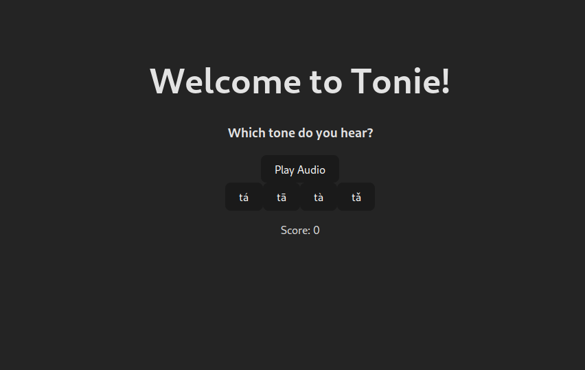

# Tonie Mandarin

## What is this?

The goal of this project is to create a tonal recognition site for those learning Mandarin.
The basic idea is a syllable will be played and the user must match what they hear with correct tone.

### Current progress:

### To-do:

- [x] Styling
- [ ] Add limit to incorrect answers
- [x] Map tones with audio URLs
- [x] Create randomized tone/pinyin guessing
- [ ] Track both correct and incorrect answers
- [ ] Error handling

### Possible features:

- User accounts
- Site themes
- Full Mandarin translation
